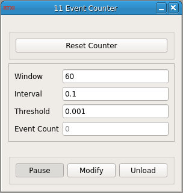

### Event Counter

**Requirements:** none
**Limitations:** none

<!--start-->

<b>EventCounter:</b> QWhatsThis description.

<!--end-->

#### Input
1. input(0) - Input Signal : Signal to detect events on

#### Output
1. output(0) - TTL Output : Output TTL when event is detected

#### Parameters
1. Window - Window size in seconds for event_counting event
2. Interval - Interval between events in seconds
3. Threshold - Detection threshold in volts

#### States
1. Event Count - Events detected in specified window
