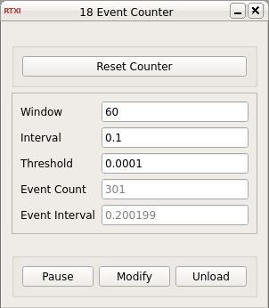

### Event Counter

**Requirements:** None  
**Limitations:** None  

<!--start-->

<b>Event Counter:</b> Event counter for analog and digital signals with configurable windows, event intervals, and threshold.

<!--end-->

#### Input
1. input(0) - Input Signal : Signal to detect events on

#### Output
1. output(0) - TTL Output : Output TTL when event is detected

#### Parameters
1. Window - Window size in seconds for event_counting event
2. Interval - Interval between events in seconds
3. Threshold - Detection threshold in volts

#### States
1. Event Count - Events detected in specified window
2. Event Interval - Duration between detected events in s
